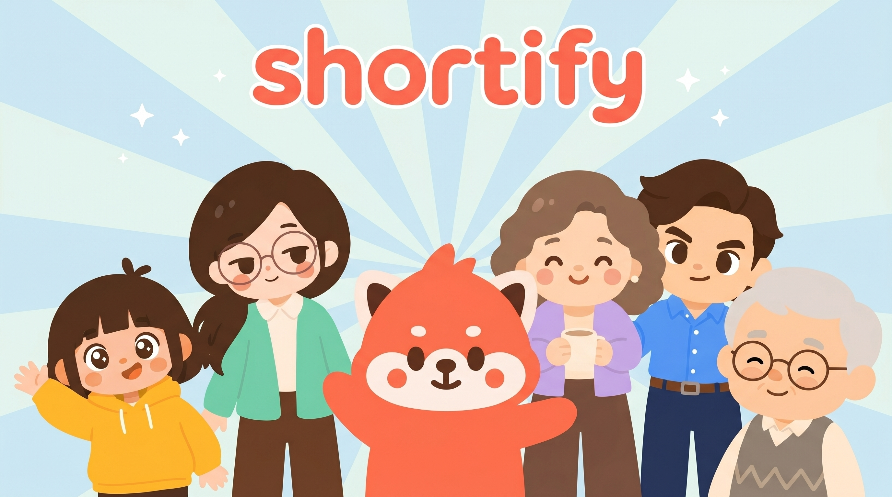

# Shortify

> **Turn knowledge into short-form videos for faster learning**
>
> 교과서 PDF를 드롭하면 목차 단위로 30~60초 학습 숏폼을 자동 생성해주는 macOS 데스크톱 앱.



---

## 개요

Shortify는 PDF 한 권을 드롭하면, 사용자가 선택한 목차 단위마다 한 편씩 1080×1920 세로 학습 영상을 만들어 라이브러리에 채워주는 macOS 앱이다. 영상 1편은 **Hook → Core Idea → Mechanism → Recap** 4비트 학습 구조를 따른다.

- **입력**: PDF (v0)
- **출력**: 1080×1920, 30fps, 30~60초 MP4
- **타겟**: 하루 한 개념씩 마이크로러닝하고 싶은 학습자
- **차별점**: PDF 본문 그대로 반영 (텍스트 레이어 없으면 Gemini multimodal로 OCR 폴백) · 캐릭터 6인 캐스트 · 출처 인용 · 핵심 용어 자막 하이라이트
- **AI 스택**: 모든 외부 AI 호출은 Google Gemini API로 통합 (`models/gemini-3.1-flash-lite-preview` · `models/gemini-3.1-flash-image-preview` · `models/veo-3.1-fast-generate-preview` · `models/gemini-3.1-flash-tts-preview`)

---

## 아키텍처 (요약)

```
┌──────────────────────────────────────────────────────┐
│ Shortify.app                                         │
│  ├─ Tauri Shell (Rust)         ← UI 호스트, OS 브리지 │
│  ├─ React UI (WKWebView)       ← 사용자 인터페이스    │
│  └─ Python Sidecar (FastAPI)   ← 영상 생성 코어       │
└──────────────────────────────────────────────────────┘
        │                    │
   localhost HTTP        외부 HTTPS
        │                    │
        ▼                    ▼
  ~/Library/.../Shortify   외부 AI APIs (Gemini)
```

별도 **Admin 대시보드** (`admin/`, port 1421) — Vite + React로 분리된 모니터링 프로젝트. `/admin/state` 엔드포인트를 폴링해 Jobs · Queue · Events · AI Traces를 라이브로 본다.

### 7-Layer 구조

| Layer                    | 책임                            | 주요 기술                                          |
| ------------------------ | ------------------------------- | -------------------------------------------------- |
| L1 Presentation          | 사용자 인터랙션, 진행 시각화    | React 19, Vite, Tailwind, Zustand                  |
| L2 Shell / Native Bridge | OS API, 사이드카 생애주기, 보안 | Tauri 2, Rust, security-framework                  |
| L3 API                   | localhost RPC, SSE 푸시         | FastAPI, uvicorn                                   |
| L4 Application / Service | 유즈케이스 오케스트레이션, 큐   | asyncio, persistent SQLite queue                   |
| L5 Domain / Pipeline     | 영상 생성 로직                  | pypdf, Pillow, ffmpeg, google-genai                |
| L6 Infrastructure        | 영속성, 비밀, 번들 바이너리     | SQLite, 로컬 FS, Keychain, ffmpeg                  |
| L7 External              | 외부 AI/미디어 API              | Google Gemini API (텍스트 · 이미지 · Veo · TTS)    |

**의존성 방향**: L1 → L2 → L3 → L4 → L5 → L6 → L7 (역방향 금지).

상세는 [`wiki/prd/architecture/`](./wiki/prd/architecture/).

---

## 사용자 플로우

```
[1] 앱 실행 → Drop View
        │   (이전에 본 PDF는 Recent PDFs에 표시 — sha256 dedup으로 재업로드 시 즉시 재사용)
        ▼
[2] PDF 드롭 또는 클릭
        │   ├─ 신규 → Gemini multimodal로 TOC 추출
        │   └─ 기존 (sha 동일) → 즉시 TOC 재사용, 추출 단계 생략
        ▼
[3] 목차 체크리스트 (최대 5개 소단위 선택)
        ▼
[4] 백그라운드: 섹션 텍스트 추출 (pypdf → Gemini OCR multimodal 폴백) +
                gemini-3.1-flash-lite로 4비트 추출 (원본 언어 그대로)
    UI: 6인 캐스트 카드 노출 (Shori 마스코트 + Pip · Iris · Jay · Vera · Sage)
        ▼
[5] 사용자 캐릭터 선택 → 14씬 분할 → 이미지(Imagen) → I2V(Veo, 무음) →
    TTS(Gemini 네이티브) → 단어 정렬(Gemini Audio) → ffmpeg 컴포즈 (자막 burn-in + BGM)
        ▼
[6] 라이브러리에 final.mp4 추가 → 인앱 재생 + Show in Finder + 공유
```

---

## 처리 단계 (Stage)

| stage | 이름                    | 작업                                                          | ETA      |
| ----- | ----------------------- | ------------------------------------------------------------- | -------- |
| 0     | `queued`                | 큐 등록                                                       | 즉시     |
| 1     | `extracting_section`    | PDF 섹션 텍스트 추출 (pypdf → Gemini multimodal 폴백)         | ~5~15s   |
| 2     | `conceptizing`          | gemini-3.1-flash-lite로 제목/주제/4비트 (원본 언어 자동 감지) | ~15s     |
| 3     | `awaiting_image_choice` | 사용자 캐릭터 선택 대기 (미리 선택 시 자동 통과)              | (사용자) |
| 4     | `generating_images`     | Imagen으로 14장 이미지 (글자/로고/UI 금지)                    | ~60s     |
| 5     | `generating_clips`      | Veo Fast I2V로 14 클립 (무음, 9:16)                           | ~5~7m    |
| 6     | `generating_narration`  | Gemini TTS (prebuilt voice)                                   | ~30s     |
| 7     | `aligning`              | Gemini Audio (word-level timestamps)                          | ~30s     |
| 8     | `composing`             | ffmpeg 리듬 컷 + 자막 burn-in + BGM                           | ~2m      |
| 9     | `done`                  | final.mp4 저장 완료                                           | —        |
| -1    | `failed`                | 에러 (stage-aware retry — 캐시된 산출물 재사용)               | —        |

영상 1편 ETA: **~10~12분** (이미지 선택 대기 시간 제외).

**Stage-aware retry**: `POST /jobs/{id}/retry` 호출 시 DB 상태 + 디스크 산출물(`output/<job>/images/`, `clips/`, `narration.wav`)을 보고 가장 늦은 안전한 stage에서 재개. Veo 단계만 실패한 경우 이미지 14장을 재사용해 클립만 다시 만든다.

**테스트 모드**: `.env`에 `SHORTIFY_TEST_MODE=1 + SHORTIFY_TEST_SCENE_COUNT=2`를 두면 Imagen·Veo 호출이 14→2회로 축소되어 dev 사이클이 빨라진다.

---

## 캐릭터 캐스트 (v1, 6인)

영상 화자는 [`wiki/design/character/`](./wiki/design/character/) 명세 기반 6인.

| Slug | 이름 | 역할 | 메인 컬러 |
|------|------|------|----------|
| `shori` | Shori | 대표 마스코트 (레서판다, 앱 인격 / 영상에는 카메오) | Spark coral `#FF6B4A` |
| `pip` | Pip | 12세 ENFP — 호기심 리액션 메이커 | Sunny yellow `#FFC83D` |
| `iris` | Iris | 24세 INFJ — 사색적 통찰가 | Mint green `#5BD4A8` |
| `jay` | Jay | 31세 ENTJ — 명료 결론부터형 | Sky blue `#4A9BFF` |
| `vera` | Vera | 52세 ESFJ — 따뜻한 경험 기반 | Lavender `#B69CE8` |
| `sage` | Sage | 71세 ISTP — 과묵한 장인 | Warm gray `#8B7E72` |

각 캐릭터의 image_style_preset과 portrait는 **identity-lock** 프롬프트와 ref 이미지로 매 씬 동일 인물을 유지한다 (`assets/image_concepts/<slug>/ref_*.png` 자동 첨부).

---

## 레포 구조

```
shortify/
├── src-tauri/                     # Rust shell (Tauri 2)
│   ├── src/{main,sidecar,keychain}.rs
│   ├── icons/                     # 앱 번들 아이콘
│   └── capabilities/              # plugin permissions
├── src/                           # React + Vite 프론트엔드
│   ├── pages/                     # DropView · TocCheckList · ImageConceptPicker · JobProgressBoard · VideoLibrary · Settings
│   ├── components/                # brand · ui · layout
│   ├── lib/                       # api.ts · sse.ts · tauri.ts
│   └── store/                     # Zustand
├── admin/                         # 별도 Vite + React 프로젝트 (포트 1421)
│   └── src/components/            # StatBar · ConfigPanel · JobsPanel · QueuePanel · EventsPanel · TracesPanel
├── sidecar/                       # Python 백엔드 (FastAPI)
│   └── shortify_sidecar/
│       ├── main.py · settings.py · notify.py
│       ├── api/                   # health · upload · toc · jobs · concepts · admin
│       ├── db/                    # models.py · session.py · seed.py · migrations/
│       ├── queue/                 # base.py · sqlite_impl.py · workers.py
│       ├── pipeline/              # _gemini · _trace · ingest_pdf · conceptizer · scene_splitter · image_gen · video_gen · narration_gen · alignment · rhythm_cut · compose · overlays · effects · make_mask
│       └── storage/
├── assets/                        # 런타임 자산
│   ├── image_concepts/            # 6인 캐릭터 ref + preview (shori/pip/iris/jay/vera/sage)
│   ├── fonts/                     # Pretendard, Black Han Sans
│   ├── bgm/                       # 라이선스 클리어 BGM
│   └── ffmpeg/                    # arm64 정적 ffmpeg
├── design/                        # 디자인 원본 (브랜드 · 캐릭터 · UI · 마케팅)
├── prompts/                       # toc_extractor · conceptizer · scene_director (참조 사본)
├── docs/                          # getting-started · session-history
├── scripts/                       # setup.sh · dev.sh
├── wiki/                          # PRD · architecture · design · members
└── .github/workflows/release.yml
```

---

## 기술 스택

| 영역            | 선택                                                   |
| --------------- | ------------------------------------------------------ |
| 앱 셸           | Tauri 2.x (Rust)                                       |
| UI              | React 19 + Vite + Tailwind + Zustand                   |
| 사이드카        | Python 3.12 + FastAPI + uvicorn                        |
| DB              | SQLite (sqlmodel + Alembic)                            |
| 작업 큐         | asyncio + SQLite-backed persistent queue (PG-portable) |
| PDF 파싱        | pypdf + Gemini multimodal 폴백 (스캔본 OCR)            |
| LLM (text)      | `models/gemini-3.1-flash-lite-preview`                 |
| 이미지 생성     | `models/gemini-3.1-flash-image-preview`                |
| 영상 생성 (I2V) | `models/veo-3.1-fast-generate-preview`                 |
| 음성 합성 (TTS) | `models/gemini-3.1-flash-tts-preview` (네이티브 오디오, WAV) |
| 음성 정렬       | `models/gemini-3.1-flash-lite-preview` (Gemini Audio)  |
| ffmpeg          | arm64 정적 바이너리 (앱 번들 포함, Apple Silicon only) |
| 사이드카 패키징 | PyInstaller (--onefile, arm64)                         |
| Keychain        | `security-framework` crate                             |
| 자동 업데이트   | Sparkle (EdDSA 서명)                                   |
| 배포            | DMG + GitHub Releases + Sparkle appcast                |

모델 ID는 모두 `SHORTIFY_MODEL_*` env로 override 가능. `/admin/gemini/models`에서 키 권한 가용 ID 확인.

---

## 로컬 개발

```bash
# 0. 첫 셋업 (한 번)
./scripts/setup.sh    # Node 20+ / pnpm 10.16+ / Python 3.12 / cargo 검증 + 의존성 설치 + dist 빌드

# 1. .env 작성
cp .env.example .env  # GEMINI_API_KEY 채우기

# 2. 풀 데스크톱 셸로 dev
pnpm tauri dev        # Tauri Shell이 사이드카를 자동 spawn

# (또는) 사이드카 + 웹만 가볍게
./scripts/dev.sh      # http://localhost:1420
```

API 키는 dev 모드에서는 `.env`에서 로드 (Keychain prompt 회피), prod 빌드에서는 Settings UI 입력 → macOS Keychain.

### 어드민 대시보드

```bash
cd admin
pnpm install
pnpm dev              # http://localhost:1421
```

브라우저에서 사이드카 Base URL 입력 → Connect → 3초마다 폴링.
[자세한 사용법](./admin/README.md).

### 필요한 API 키

| 키               | 용도                                                                                              |
| ---------------- | ------------------------------------------------------------------------------------------------- |
| `GEMINI_API_KEY` | 모든 AI 호출 (텍스트 · 이미지 · Veo · TTS · 오디오 정렬). Google AI Studio / Vertex AI 키 1개 |

자세한 env 옵션은 [`.env.example`](./.env.example).

---

## 빌드 & 릴리즈

GitHub Actions (macOS runner)에서 `v*` 태그 푸시로 트리거:

1. `pnpm vite build` (frontend → `dist/`)
2. `pyinstaller PyInstaller.spec --target-arch arm64` (사이드카 단일 실행파일)
3. `cargo tauri build --target aarch64-apple-darwin` (Rust + 사이드카 + ffmpeg + assets)
4. `codesign --deep --options=runtime --entitlements ...`
5. `xcrun notarytool submit --wait`
6. `xcrun stapler staple`
7. `create-dmg → Shortify-x.y.z.dmg`
8. Sparkle EdDSA 서명 + `appcast.xml`
9. `gh release create`

```bash
git tag v1.2.3 && git push origin v1.2.3
```

상세: [`wiki/prd/architecture/07-build-deploy.md`](./wiki/prd/architecture/07-build-deploy.md).

---

## 데이터 위치

| 항목           | 경로                                                               |
| -------------- | ------------------------------------------------------------------ |
| DB             | `~/Library/Application Support/Shortify/db.sqlite`                 |
| 원본 PDF       | `~/Library/Application Support/Shortify/pdfs/<id>.pdf`             |
| 영상 산출물    | `~/Library/Application Support/Shortify/output/<job_id>/`          |
| 원격 ref 캐시  | `~/Library/Application Support/Shortify/ref_cache/`                |
| 로그           | `~/Library/Application Support/Shortify/logs/sidecar.log`          |
| API 키         | macOS Keychain (`shortify` service · `gemini` key) — prod 한정     |

dev 환경 격리: `SHORTIFY_DATA_DIR=/tmp/shortify-dev` env로 오버라이드.

전체 데이터 초기화: `rm -rf ~/Library/Application\ Support/Shortify` → 다음 부팅 시 alembic이 새 schema + 캐릭터 6명 자동 시드.

**Soft Delete**: 데이터 삭제는 `deleted_at` 마킹만, 파일·DB row는 보존. `DELETE /trash`를 명시 호출해야 hard purge.

---

## 보안 핵심

- **사이드카 = 127.0.0.1 바인딩**. 외부 노출 안 됨
- **API 키 = `.env` (dev) / macOS Keychain (prod) 전용**. 평문 파일/SQLite/로그 절대 저장 금지
- **dev 모드에서는 Keychain 안 건드림** — cargo 매번 ad-hoc 서명 변경으로 인한 ACL 캐시 무효화 prompt 회피
- **외부 호출 HTTPS only**, 인증서 검증 활성
- **CORS** — Vite origin (1420) ↔ 사이드카 cross-origin 허용 (BYOK + localhost-only이라 안전)
- **Sparkle 업데이트 EdDSA 서명 검증** + Apple notarization
- **Hardened runtime** (`entitlements.plist`): `network.server` false, `network.client` true

상세: [`wiki/prd/architecture/08-security.md`](./wiki/prd/architecture/08-security.md).

---

## 비용 (영상 1편, BYOK 기준 · Gemini API)

| 항목                  | 모델                                              | 단가                  | 1편 사용량       | 소계    |
| --------------------- | ------------------------------------------------- | --------------------- | ---------------- | ------- |
| 컨셉 추출 + 씬 디렉션 | `models/gemini-3.1-flash-lite-preview`            | $1.25/M in · $5/M out | ~10K in / 5K out | ~$0.04  |
| PDF OCR 폴백 (필요시) | `models/gemini-3.1-flash-lite-preview` multimodal | 동일 + PDF 인라인     | 1회/job          | ~$0.05  |
| 이미지 (14장)         | `models/gemini-3.1-flash-image-preview`           | ~$0.04/장             | 14장             | ~$0.56  |
| I2V (14 클립 × 6초)   | `models/veo-3.1-fast-generate-preview`            | ~$0.15/sec            | ~84초            | ~$12.60 |
| 나레이션 TTS          | `models/gemini-3.1-flash-tts-preview`             | ~$0.50/M chars        | ~1500 chars      | ~$0.01  |
| 오디오 정렬           | `models/gemini-3.1-flash-lite-preview`            | 표준 audio 토큰 단가  | ~30초            | ~$0.01  |

**합계: ~$13/편** (Veo Fast + 6초 클립 기준).

테스트 모드 (2씬)이면 ~$2/편으로 축소. 단가는 변동 가능 — 실측 후 갱신.

개발사 인프라 비용: 외부 백엔드 없음 → 거의 0원. GitHub Actions ~$10/월 + Apple Developer Program $99/년.

---

## 문서 인덱스

위키 루트: [`wiki/`](./wiki/) · 사람용 가이드: [`docs/getting-started.md`](./docs/getting-started.md) · AI 에이전트용: [`AGENTS.md`](./AGENTS.md) · v0 빌드 회고: [`docs/session-history.md`](./docs/session-history.md)

### 기획 / 아키텍처

- 기획안: [`wiki/prd/IDEA.md`](./wiki/prd/IDEA.md)
- 단계별 로드맵: [`wiki/prd/plan.md`](./wiki/prd/plan.md)
- 아키텍처:
  - [01 Overview](./wiki/prd/architecture/01-overview.md) · [02 Frontend](./wiki/prd/architecture/02-frontend.md) · [03 Sidecar](./wiki/prd/architecture/03-sidecar.md)
  - [04 Data Model](./wiki/prd/architecture/04-data-model.md) (Future PG Migration 6 규칙 포함)
  - [05 API Spec](./wiki/prd/architecture/05-api-spec.md) · [06 Pipeline](./wiki/prd/architecture/06-pipeline.md)
  - [07 Build & Deploy](./wiki/prd/architecture/07-build-deploy.md) · [08 Security](./wiki/prd/architecture/08-security.md)

### 디자인 / 브랜드 / 캐릭터

문서 인덱스: [`wiki/design/`](./wiki/design/) · 자산 원본: [`design/`](./design/)

- 브랜드: [Identity](./wiki/design/brand/01-identity.md) · [Logo](./wiki/design/brand/02-logo.md) · [Color](./wiki/design/brand/03-color.md) · [Typography](./wiki/design/brand/04-typography.md)
- 캐릭터: [Bible (Shori)](./wiki/design/character/01-bible.md) · [Usage](./wiki/design/character/02-usage.md) · [Cast 5인](./wiki/design/character/03-cast.md)
- UI: [Principles](./wiki/design/ui/01-principles.md) · [Tokens](./wiki/design/ui/02-tokens.md) · [Components](./wiki/design/ui/03-components.md)

### 팀 / 협업

- [팀원 소개](./wiki/members.md) — 박경선 · 김경민 · 강호남 · 김성곤
- [v0 빌드 회고](./docs/session-history.md) — 80+ 커밋의 의사결정 트레이스
