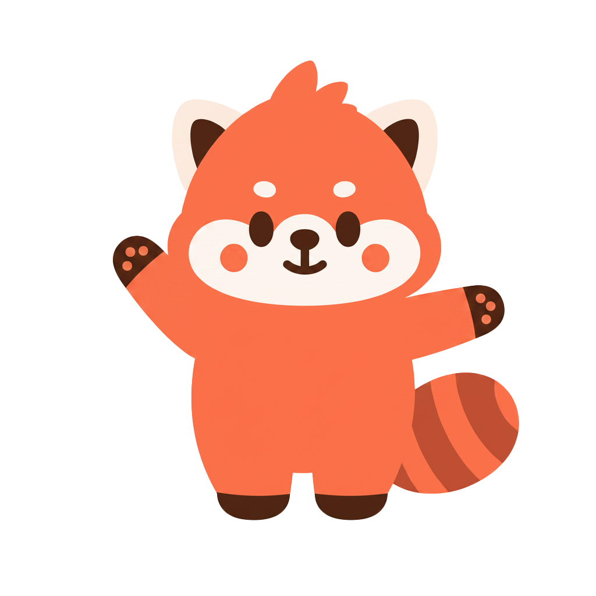
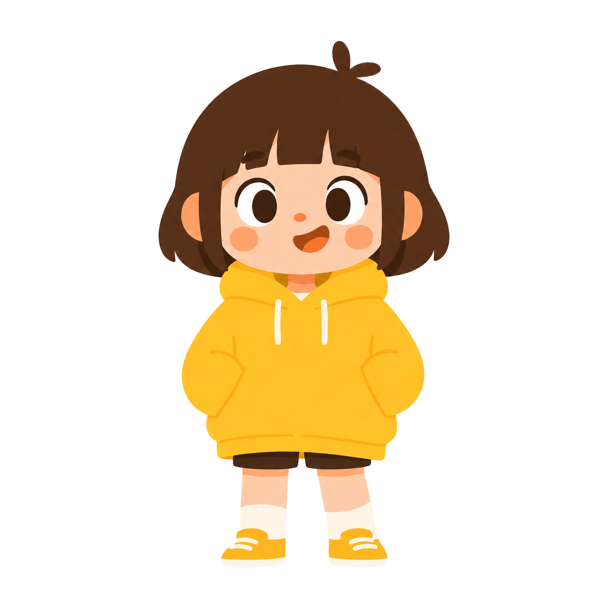
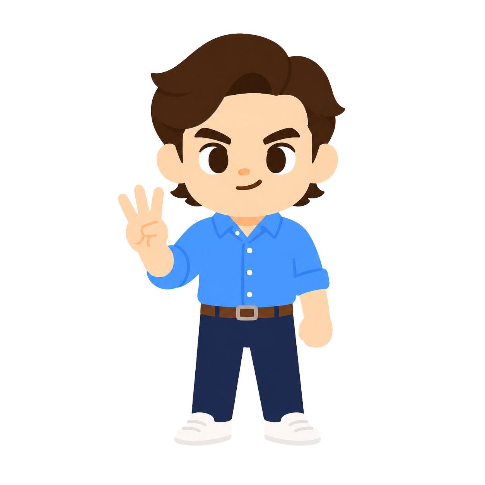
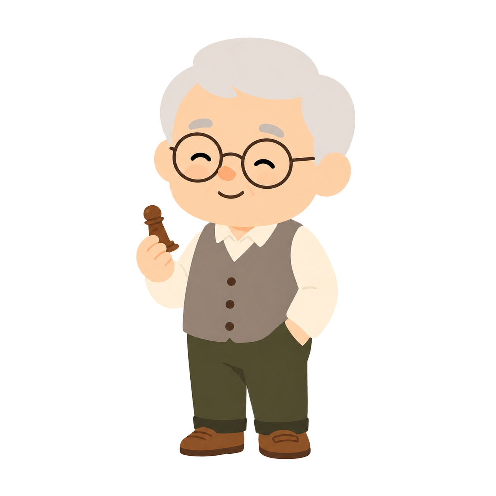

# 03. Character Cast — Pip · Iris · Jay · Vera · Sage

> **Owner**: 김성곤 · **Status**: Approved · **Last Updated**: 2026-04-26 · **Source**: Shortify Character Cast Guide v1.1 + 캐스트 포트레이트 v1

Shortify의 **캐릭터 캐스트 6인** — 대표 마스코트 [쇼리(Shori)](./01-bible.md) + 영상 화자 5인(Pip / Iris / Jay / Vera / Sage). 자산은 모두 `design/character/cast/{id}/` 동일 구조로 관리한다. 단, **활동 무대는 다르다** — 쇼리는 앱 UI(빈 화면 / 스트릭 / 푸시) 메인 + 영상 카메오, 5인은 영상 본편 메인 화자.

---

## 0. 정본 비주얼 자산

서비스 레벨에서는 **쇼리도 캐스트의 일원**으로 동일하게 취급된다. 단, 쇼리는 _대표 캐릭터(앱 인격 / 마스코트)_ 로서 푸시·빈 화면·스트릭 등 앱 UI에서도 노출되며, 5인 캐스트는 영상 본편 화자가 메인 활동 무대다. 자산 구조도 `design/character/cast/{id}/cast_{id}_portrait_v1.png` 로 통일한다.

| 캐릭터 | 역할 | 정본 포트레이트 |
|--------|------|----------------|
| **Shori** (쇼리) | 대표 / 앱 인격 + 영상 카메오 | [`/design/character/cast/shori/cast_shori_portrait_v1.png`](../../../design/character/cast/shori/cast_shori_portrait_v1.png) |
| Pip | 캐스트 (12세 ENFP) | [`/design/character/cast/pip/cast_pip_portrait_v1.png`](../../../design/character/cast/pip/cast_pip_portrait_v1.png) |
| Iris | 캐스트 (24세 INFJ) | [`/design/character/cast/iris/cast_iris_portrait_v1.png`](../../../design/character/cast/iris/cast_iris_portrait_v1.png) |
| Jay | 캐스트 (31세 ENTJ) | [`/design/character/cast/jay/cast_jay_portrait_v1.png`](../../../design/character/cast/jay/cast_jay_portrait_v1.png) |
| Vera | 캐스트 (52세 ESFJ) | [`/design/character/cast/vera/cast_vera_portrait_v1.png`](../../../design/character/cast/vera/cast_vera_portrait_v1.png) |
| Sage | 캐스트 (71세 ISTP) | [`/design/character/cast/sage/cast_sage_portrait_v1.png`](../../../design/character/cast/sage/cast_sage_portrait_v1.png) |

> 쇼리 상세 명세 / 마스코트 시트·turnaround 등 마스터 자산은 [`01-bible`](./01-bible.md) + [`/design/character/final/`](../../../design/character/final/). 작업 폴더 인덱스: [`/design/character/cast/`](../../../design/character/cast/).

---

## 1. 캐스팅 철학

### 두 축의 곱

영상 화자 5인은 **연령(세대)** × **성격(MBTI)** 의 교차점에 자리한다. 같은 주제도 누가 어떻게 말하느냐에 따라 다른 콘텐츠가 되도록 설계. 쇼리는 사람 캐스트의 매트릭스 바깥 — 마스코트 동물 캐릭터로 별도 축에 위치.

- **연령 축**: 12세 / 24세 / 31세 / 52세 / 71세 (사람 캐스트)
- **성격 축**: 외향(E) 3 : 내향(I) 2 — 외향이 약간 우세하지만 균형.
- **마스코트 축**: 쇼리(레서판다, 앱 인격)

### 캐스트의 역할

1. **콘텐츠 큐레이션** — "오늘은 누구한테 배울까?" 로 콘텐츠 진입.
2. **숏폼 화자** — AI가 자동 생성한 영상의 내레이터/진행자.
3. **체험 시연** — 학습 내용을 캐릭터가 먼저 경험하고 반응 (예: 새 단어를 듣고 따라하기, 실험).
4. **감정 동반자** — 어려울 때 공감, 잘했을 때 함께 기뻐함.

### 쇼리 vs 캐스트

| 구분 | 쇼리(Shori) | 5인 캐스트 |
|------|------------|------------|
| 인격 | 앱의 인격 (브랜드) | 콘텐츠의 인격 (화자) |
| 등장 위치 | 푸시 / 빈 화면 / 스트릭 / 앱 UI | **영상 안** |
| 영상 본편 안 | ❌ 사용 안 함 ([02-usage §2](./02-usage.md#2-사용-위치-앱-외)) | ✅ 메인 화자 |
| 상호 관계 | 캐스트를 응원하는 마스코트 — 영상 모서리에서 박수 등 보조 등장 가능 | 쇼리와 함께 등장해도 충돌하지 않도록 보조 팔레트 사용 |

### 네이밍 원칙

전 캐릭터 영문 1~2음절. 발음이 서로 겹치지 않아 듣자마자 구분 가능.

```
Shori   ·   Pip   ·   Iris   ·   Jay   ·   Vera   ·   Sage
마스코트       12세         24세         31세         52세         71세
```

---

## 2. 비주얼 스타일 가이드

### 공통 원칙

| 항목 | 사양 |
|------|------|
| 스타일 | 듀오링고풍 단순 2D 일러스트 (플랫 컬러, 외곽선 최소화) |
| 비례 | 2.5~3등신 (귀여움 우선) |
| 아웃라인 | 없음 또는 매우 얇게 (`#1A1614` 0.5px) |
| 색 사용 | 캐릭터당 메인 컬러 1 + 보조 컬러 1~2 |
| 표정 | 눈썹 + 눈 + 입의 3요소로 베리에이션 (8~10종 시트 필요) |
| 포즈 | 정면 + 3/4 측면 + 측면, **상반신 위주** (숏폼 화면에 맞춤) |

### 캐릭터별 메인 컬러 배정

쇼리는 **메인 코랄**(`#FF6B4A`) — 브랜드 동일색을 그대로 사용해 앱 인격임을 시각화. 나머지 5인 캐스트는 **보조 팔레트에서 한 컬러씩** — 함께 등장해도 시각 위계가 무너지지 않도록 설계.

| 캐릭터 | 메인 컬러 | HEX | 토큰 |
|--------|-----------|-----|------|
| **Shori** | Spark coral | `#FF6B4A` | `coral-500` / `brand-primary` (브랜드 동일색) |
| Pip | Sunny yellow | `#FFC83D` | `yellow-500` (기존) |
| Iris | Mint green | `#5BD4A8` | `mint-500` (기존) |
| Jay | Sky blue | `#4A9BFF` | `sky-500` (기존) |
| Vera | **Lavender** | `#B69CE8` | `cast-lavender-500` (**캐스트 팔레트 신설**) |
| Sage | **Warm gray** | `#8B7E72` | `cast-warm-gray-500` (**캐스트 팔레트 신설**) |

> Lavender / Warm gray는 5인 캐스트를 위한 신규 보조 컬러. [`brand/03-color §1`](../brand/03-color.md#1-코어-팔레트) `cast-*` 토큰 등록.

---

## 3. 캐스트 6인 — 상세

### 3.0 Shori — 대표 / 마스코트

> _"한 입만 더 어때요?"_



| 항목 | 내용 |
|------|------|
| 종 | 레서판다 (Red panda) |
| 역할 | 앱 인격(브랜드 마스코트) + 영상 카메오 (모서리 박수·응원 보조 등장) |
| 메인 컬러 | Spark coral `#FF6B4A` (브랜드 동일색) |
| 외형 | 둥글고 통통한 비율, 페이스 마스크(Cream), Dark Brown `#3A2A23` 포인트, 줄무늬 꼬리 |
| 시그니처 | 페이스 마스크 + 줄무늬 꼬리 + 옅은 핑크 볼터치 |
| 톤 키워드 | 호기심 / 친근함 / 꾸준함 |

**담당** — 푸시 / 빈 화면 / 스트릭 축하 / 학습 시작·완료 모먼트 / 라이브러리 빈 상태. 영상 본편 화자는 ❌ — 모서리 카메오만 허용.

**시청자 효과** — "한 입 더 권유"의 부드러운 압박. 압박형이 아닌 권유형이라 사용자가 부담 없이 매일 돌아옴.

**상세 명세** — [01-bible](./01-bible.md) (성격 4 필러 / 표정 8종 / 포즈 4종 / 4-view turnaround / IN USE 5종).

---

### 3.1 Pip — 12세, ENFP

> _"이거 진짜 신기하지 않아요?!"_



| 항목 | 내용 |
|------|------|
| 이름 의미 | 작은 씨앗, 톡톡 튀는 1음절 어감 |
| 나이 | 초등학교 6학년, 12세 |
| MBTI | ENFP — 호기심 폭발, 감정 표현 풍부, 산만하지만 사랑스러움 |
| 메인 컬러 | Sunny yellow `#FFC83D` |
| 외형 | 단발 보브, 큼직한 후드티, 양쪽 주머니에 손, 한쪽 무릎 양말이 흘러내려 있음 |
| 시그니처 | 한쪽 입꼬리만 올린 미소, 눈을 크게 뜬 놀라움 |

**담당 콘텐츠** — "왜?"로 시작하는 호기심 콘텐츠 / 과학 실험 시연 / 수학 퍼즐 / 자연 현상 / 어린이·입문자용.

**시청자 효과** — Pip이 놀라면 시청자도 놀라는 "리액션 메이커". 어려운 개념도 Pip이 "헐, 진짜요?" 하는 순간 만만해짐.

**쇼리와의 관계** — 가장 친한 짝꿍. 영상에서 자주 함께 등장.

---

### 3.2 Iris — 24세, INFJ

> _"음... 그건 좀 다르게 볼 수도 있어요."_


| 항목 | 내용 |
|------|------|
| 이름 의미 | 무지개의 그리스 여신. 시적이고 사색적 |
| 나이 | 대학원생 / 사회 초년생, 24세 |
| MBTI | INFJ — 사색적, 차분, 깊이 있는 통찰 |
| 메인 컬러 | Mint green `#5BD4A8` |
| 외형 | 긴 생머리를 한쪽으로 묶음, 라운드 안경, 헐렁한 니트 카디건, 책을 들고 있는 경우가 많음 |
| 시그니처 | 살짝 고개를 기울인 자세, 옅은 미소 |

**담당 콘텐츠** — 인문학 / 철학 / 심리학 / 문학 / 정답 없는 "생각해볼 거리" / 차분한 야간 시간대.

**시청자 효과** — 빠른 피드 속에서 잠시 숨을 고르게. Iris 영상은 더 길게 머물러도 부담 없음.

**시그니처 카피** — "이건 정답이 없어요. 하지만 한 번 생각해볼 만하죠."

> ⚠️ Mint green은 UI에서 [정답·완료 전용](../brand/03-color.md#3-컬러-운영-원칙)으로 잠겨 있다. **Iris의 메인 컬러는 영상/포스터/카드** 안에서만 사용 — 앱 UI 내 "정답"과 의미 충돌이 없도록 배경/소품에만 적용.

---

### 3.3 Jay — 31세, ENTJ

> _"세 줄 요약 갑니다. 하나, 둘, 셋."_



| 항목 | 내용 |
|------|------|
| 이름 의미 | 즉시성과 명료함의 1음절. Blue Jay(파랑새)와 컬러 매칭 |
| 나이 | 30대 초반 직장인 / 자영업자, 31세 |
| MBTI | ENTJ — 명료, 효율, 자신감 |
| 메인 컬러 | Sky blue `#4A9BFF` |
| 외형 | 깔끔한 미디엄 헤어, 셔츠 소매를 걷어 올림, 손가락으로 카운트하는 동작 |
| 시그니처 | 정면을 바라보며 단호한 입매, 손가락 1·2·3 제스처 |

**담당 콘텐츠** — 비즈니스 / 경제 / 시사 / IT 트렌드 / "10초 안에 핵심" 요약 / 출근길·점심시간용.

**시청자 효과** — 시간 없는 사용자를 위한 "최단 거리". Jay의 영상은 항상 60초 이내, 결론부터.

**시그니처 카피** — "오늘 알아갈 한 가지. 그거 하나면 돼요."

---

### 3.4 Vera — 52세, ESFJ

> _"제가 살아보니까요, 이게 진짜더라고요."_


| 항목 | 내용 |
|------|------|
| 이름 의미 | 라틴어 "진실(truth)". 어른의 진정성 |
| 나이 | 50대 중년, 52세 |
| MBTI | ESFJ — 따뜻함, 경험 기반, 챙김 |
| 메인 컬러 | Lavender `#B69CE8` (**캐스트 신설 컬러**) |
| 외형 | 어깨 길이 펌, 진주 귀걸이, 카디건 + 셔츠, 손에 머그컵을 들고 있는 경우가 많음 |
| 시그니처 | 두 손을 모은 자세, 인자한 눈웃음 |

**담당 콘텐츠** — 생활 지식 / 건강 / 요리 / 살림 팁 / 인생 경험 기반 조언 / "엄마·이모가 알려주는" 톤.

**시청자 효과** — 디지털 학습 서비스에 흔치 않은 "어른의 경험치". 20-30대 사용자에게 부모 세대 지혜를 친근하게 전달.

**시그니처 카피** — "이거 알면 평생 써먹어요."

---

### 3.5 Sage — 71세, ISTP

> _"흠. 그게 그리 간단한 게 아니라네."_



| 항목 | 내용 |
|------|------|
| 이름 의미 | "현인(賢人)". 동시에 sage gray와 컬러 매칭 |
| 나이 | 70대 노년, 71세 |
| MBTI | ISTP — 과묵, 손재주, 깊은 전문성 |
| 메인 컬러 | Warm gray `#8B7E72` (**캐스트 신설 컬러**) |
| 외형 | 짧은 백발, 둥근 안경, 베스트(조끼), 항상 무언가를 만들고 있거나 들고 있음 |
| 시그니처 | 옅게 미소 짓는 입매, 천천히 끄덕이는 동작 |

**담당 콘텐츠** — 역사 / 전통 / 장인 기술 / 클래식 (음악·미술) / "한 분야를 평생 파온 사람만 아는" 깊이 있는 이야기 / 주말·휴식 시간대.

**시청자 효과** — Sage 영상은 "정보"가 아니라 "이야기"로 느껴짐. 빠른 콘텐츠 사이에서 호흡을 늘리는 효과.

**시그니처 카피** — "급할 거 없네. 한 가지만 제대로 알면 돼."

---

## 4. 캐스트 매트릭스

### 4.1 연령 × 성격

```
        외향(E)              내향(I)
       ┌────────────────────┬────────────────────┐
  10대 │ Pip  (ENFP)         │                    │
       ├────────────────────┼────────────────────┤
  20대 │                    │ Iris (INFJ)         │
       ├────────────────────┼────────────────────┤
  30대 │ Jay  (ENTJ)         │                    │
       ├────────────────────┼────────────────────┤
  50대 │ Vera (ESFJ)         │                    │
       ├────────────────────┼────────────────────┤
  70대 │                    │ Sage (ISTP)         │
       └────────────────────┴────────────────────┘
```

E:I = 3:2 — 외향이 약간 우세하지만 균형.

### 4.2 콘텐츠 카테고리 → 화자

| 카테고리 | 메인 화자 | 보조 화자 |
|----------|-----------|-----------|
| 과학 / 자연 | Pip | Iris |
| 인문 / 철학 | Iris | Sage |
| 비즈니스 / IT | Jay | — |
| 시사 / 경제 | Jay | Vera |
| 생활 / 건강 | Vera | Sage |
| 역사 / 전통 | Sage | Iris |
| 어린이 학습 | Pip | Vera |

> 7 → 15 카테고리 세분화 시 누가 담당할지는 [후속 작업](../05-next-steps.md).

---

## 5. 영상 등장 패턴

### 5.1 1인 진행 (기본형)

캐릭터 한 명이 60초 내내 진행. 가장 단순하고 자동 생성에 유리.

### 5.2 2인 콜라보 (티칭 + 리액션)

전문 화자 + 리액션 화자 조합 — AI가 자동으로 페어링하기 좋은 구조.

| 페어 | 효과 |
|------|------|
| Sage + Pip | 깊은 지식 + 순수한 놀라움 → "할아버지의 옛이야기" 감성 |
| Jay + Vera | 트렌드 + 인생 경험 → "세대 간 대화" |
| Iris + Pip | 깊은 사색 + 직설적 질문 → "선생님과 학생" |

### 5.3 5인 등장 (이벤트형)

스트릭 100일 달성, 시즌 오프닝 등 특별 모먼트. 듀오링고가 시즌마다 캐스트 전체를 등장시키는 것과 동일 전략.

---

## 6. 보이스 & 톤 매트릭스

| 캐릭터 | 말 빠르기 | 어휘 | 어미 | 시그니처 표현 |
|--------|-----------|------|------|---------------|
| Pip | 빠름 | 일상어, 의성어 | "~요!", "~예요?" | "헐!", "진짜요?", "신기하다" |
| Iris | 느림 | 사색적, 비유 | "~네요", "~일까요" | "음...", "한 번 생각해보면" |
| Jay | 빠름 | 명료, 비즈니스 | "~입니다", "~죠" | "결론부터", "핵심은", "세 줄 요약" |
| Vera | 중간 | 따뜻한 일상어 | "~더라고요", "~잖아요" | "제가 해보니까", "이거 알면" |
| Sage | 느림 | 깊이 있고 절제 | "~다네", "~게나" | "흠.", "그게 말일세", "급할 거 없네" |

> 전반 톤 가이드는 [`brand/01-identity §4`](../brand/01-identity.md#4-톤앤매너-voice--tone). 캐스트 톤은 그 위에 화자별 색을 얹는다.

---

## 7. UI 통합 — Character Select

[Character Select 화면](../ui/screens/03-character-select.md)의 `CHARACTERS` 데이터는 본 6인 캐스트로 등록한다 (현재 코드 정본은 `shori`만 존재 — 5인 추가 필요).

| `id` | name | tagline | mainColor 토큰 | portrait 자산 |
|------|------|---------|----------------|----------------|
| `shori` | Shori (쇼리) | 한 입만 더 어때요? — 대표 마스코트 | `coral-500` | `cast/shori/cast_shori_portrait_v1.png` |
| `pip` | Pip | 호기심 폭발, "왜?" 의 친구 | `yellow-500` | `cast/pip/cast_pip_portrait_v1.png` |
| `iris` | Iris | 사색적인 인문 안내자 | `mint-500` | `cast/iris/cast_iris_portrait_v1.png` |
| `jay` | Jay | 비즈니스·트렌드 요약가 | `sky-500` | `cast/jay/cast_jay_portrait_v1.png` |
| `vera` | Vera | 어른의 생활 지혜 | `cast-lavender-500` | `cast/vera/cast_vera_portrait_v1.png` |
| `sage` | Sage | 장인의 깊이 있는 이야기 | `cast-warm-gray-500` | `cast/sage/cast_sage_portrait_v1.png` |

> **선택 매트릭스**: 한 영상의 캐스트는 1인 또는 2인 페어. UI에서는 단일 선택부터 구현, 페어 모드는 후속. 쇼리는 영상에서 카메오로만 사용 — 메인 화자 슬롯에는 5인 우선.

---

## 8. 인계 체크리스트

- [ ] 5인 정면 1컷 — ✅ 완료 (v1 포트레이트 5장)
- [ ] **표정 시트** — 캐릭터당 8종 (`기쁨 / 놀람 / 끄덕임 / 의문 / 미소 / 진지 / 박수 / 잠깐만`)
- [ ] **포즈 시트** — 캐릭터당 5종 (`정면 / 측면 / 가리킴 / 손 흔들기 / 박수`)
- [ ] **음성 매칭** — TTS 보이스 톤 (성별 / 연령대 / 속도 / 피치) — Vera/Sage 음성 라이브러리 후보 검토 필요
- [ ] **카테고리 확장** — 7 → 15 카테고리 매핑
- [ ] **사용자 즐겨찾기** — "내가 좋아하는 화자" 설정 → 개인화 추천
- [ ] **Character Select UI 데이터 연결** — `shortify-character-select.jsx:26`의 `CHARACTERS` 배열을 본 표로 확장
- [ ] **다크모드** — Lavender / Warm gray의 다크 변형 정의

---

## 관련 문서

- 마스코트(쇼리): [01-bible](./01-bible.md)
- 마스코트 사용 규칙: [02-usage](./02-usage.md)
- 컬러 (Lavender / Warm gray 토큰): [brand/03-color](../brand/03-color.md)
- 카피 톤: [brand/01-identity §4](../brand/01-identity.md#4-톤앤매너-voice--tone)
- Character Select 화면: [ui/screens/03-character-select](../ui/screens/03-character-select.md)

---

## 변경 이력

| 날짜 | 작성자 | 변경 |
|------|--------|------|
| 2026-04-26 | 김성곤 | 쇼리를 캐스트 6인 구조로 통합 — `cast/shori/cast_shori_portrait_v1.png` 등록, §0/§2/§3.0/§7 표 갱신, 마스코트 마스터 자산(`final/`)은 시트/turnaround 보존소로 분리 |
| 2026-04-26 | 김성곤 | Character Cast Guide v1.1 + 포트레이트 v1 5장 반영 — Pip/Iris/Jay/Vera/Sage 정의, Lavender·Warm gray 신설, UI 매핑 |
