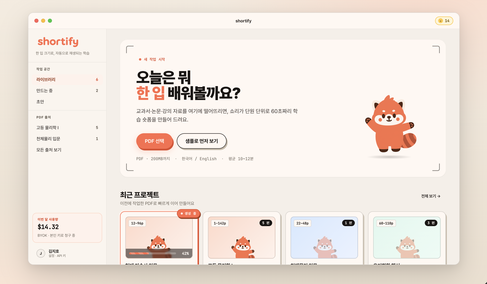

# 04-01. Main (DropView + Library)

> **Owner**: 김성곤 · **Status**: Approved · **Last Updated**: 2026-04-26 · **Step**: 1 / 4

홈 화면. PDF를 드롭해 워크플로우를 시작하고, 기존 라이브러리/최근 프로젝트를 탐색한다.

- **정본 HTML**: [`/design/ui/shortify-html-design/Shortify Main.html`](../../../../design/ui/shortify-html-design/Shortify%20Main.html)
- **정본 JSX**: [`/design/ui/shortify-html-design/shortify-main.jsx`](../../../../design/ui/shortify-html-design/shortify-main.jsx)
- **스크린샷**: [`/design/ui/screens/main-ui.png`](../../../../design/ui/screens/main-ui.png)
- **와이어프레임 참고**: [`Shortify Main - Wireframe.html`](../../../../design/ui/shortify-html-design/Shortify%20Main%20-%20Wireframe.html) — 시각 정리 전 구조 검증용



---

## 1. 레이아웃

```
┌─ MacWindow ─────────────────────────────────────────────────┐
│ ┌─ Sidebar ─┐  ┌─ TitleBar ─────────────────────────────┐  │
│ │ Traffic   │  │ Shortify  …검색…                  [+]  │  │
│ │ ───────── │  ├────────────────────────────────────────┤  │
│ │ 라이브러리 │  │  ┌─ DropZone (state) ───────────────┐ │  │
│ │ 최근       │  │  │  Shori + "여기에 PDF를 드롭"      │ │  │
│ │ 즐겨찾기   │  │  └────────────────────────────────┘  │  │
│ │ ───────── │  │  ┌─ Library (filled 시) ────────────┐ │  │
│ │ 설정      │  │  │  LibraryRow × N                  │ │  │
│ └───────────┘  │  └──────────────────────────────────┘ │  │
│                │  ┌─ RecentProjectsGrid (3-col) ─────┐ │  │
│                │  │  RecentProjectCard × N           │ │  │
│                │  └──────────────────────────────────┘ │  │
│                └────────────────────────────────────────┘  │
└─────────────────────────────────────────────────────────────┘
```

## 2. State 매트릭스

`MainView({ tweaks })` — `state` ∈ {`empty`, `dragover`, `filled`} (`shortify-main.jsx:1521`).

| state | DropZone | Library | RecentProjects | 비고 |
|-------|----------|---------|----------------|------|
| `empty` | `idle` 보더 + Shori + 카피 | (없음) | 표시 | 첫 실행 / 라이브러리 비어있음 |
| `dragover` | `dragover` (코랄 보더 + 코랄 글로우) | `MOCK_LIBRARY.slice(0,3)` | 표시 | 드래그 중 |
| `filled` | (DropZone 숨김) | `MOCK_LIBRARY` 전체 | 표시 | PDF 처리 중/완료 잡 존재 |

## 3. 컴포넌트

| 영역 | 컴포넌트 | 정본 라인 |
|------|----------|-----------|
| 상단 좌측 | `Sidebar` (activeKey="library") | `shortify-main.jsx:498` |
| 상단 | `TitleBar` | `:367` |
| 메인 | `DropZone` | `:635` |
| 메인 | `Library` (`density` ∈ compact/cozy/spacious) | `:1040` |
| 메인 | `LibraryRow` (`StatusPill` + `ProgressBar` 포함) | `:941` |
| 하단 | `RecentProjectsGrid` (3-column) | `:1466` |
| 카드 | `RecentProjectCard` | `:1185` |
| 보조 | `CharacterAvatar`, `ThumbPlaceholder`, `Btn` | `:1152, :304, :211` |

## 4. 마스코트 / 카피

DropZone idle 상태에서 `Shori` (`pose="wave"`, size 220, `shori-pulse` 코랄 글로우):

- `empty`: "여기에 PDF를 드롭해서 시작해 봐!"
- `dragover`: "놓으면 시작할게!" (talking)

## 5. 인터랙션

| 트리거 | 결과 |
|--------|------|
| PDF 파일 드래그 진입 | `state: empty → dragover` (200ms `easing-emphasis`) |
| PDF 드롭 | TOC Select 화면으로 전환 (Step 1 → 2) |
| LibraryRow 클릭 (status=done) | 비디오 플레이어 모달 |
| LibraryRow 클릭 (status=failed) | 재시도 다이얼로그 |
| `+` 버튼 (TitleBar) | 파일 선택 다이얼로그 → PDF 드롭과 동일 |

## 6. Tweaks 디폴트 (`Shortify Main.html:124-129`)

```json
{ "state": "empty", "windowMode": "framed", "showSidebar": true, "density": "compact" }
```

## 7. 인계 체크리스트

- [ ] DropZone 3-state 시각 / 카피
- [ ] Library density 3종 (compact/cozy/spacious) 행 높이 시안
- [ ] StatusPill 4-state (queued/running/done/failed)
- [ ] LibraryRow ProgressBar 줄무늬 키프레임 (`progress-stripes`)
- [ ] RecentProjectCard hover lift
- [ ] 다크모드 (현재 라이트만)

---

## 변경 이력

| 날짜 | 작성자 | 변경 |
|------|--------|------|
| 2026-04-26 | 김성곤 | HTML 정본 + 스크린샷 기반 화면 명세 작성 |
