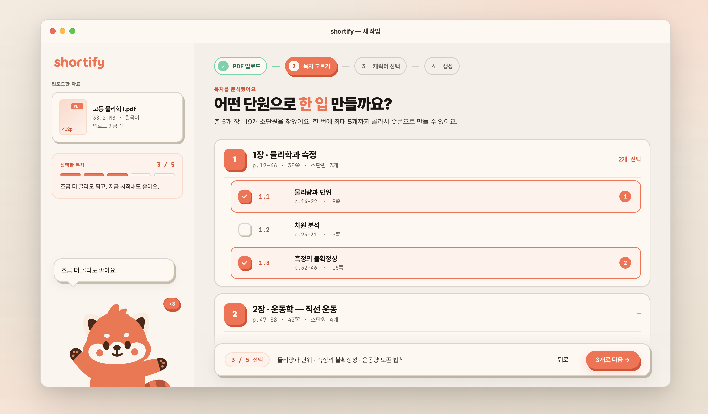

# 04-02. TOC Select (목차 선택)

> **Owner**: 김성곤 · **Status**: Approved · **Last Updated**: 2026-04-26 · **Step**: 2 / 4

PDF에서 추출한 목차에서 영상 1편당 다룰 섹션을 **최대 5개** 고른다.

- **정본 HTML**: [`/design/ui/shortify-html-design/Shortify TOC Select.html`](../../../../design/ui/shortify-html-design/Shortify%20TOC%20Select.html)
- **정본 JSX**: [`/design/ui/shortify-html-design/shortify-toc-select.jsx`](../../../../design/ui/shortify-html-design/shortify-toc-select.jsx)
- **스크린샷**: [`/design/ui/screens/step2-ui.png`](../../../../design/ui/screens/step2-ui.png)



---

## 1. 레이아웃

```
┌─ MacWindow ─────────────────────────────────────────────────┐
│ ┌─ Sidebar ─┐ ┌─ TitleBar ──────────────────────────────┐  │
│ │           │ │ Shortify                                │  │
│ │           │ ├─────────────────────────────────────────┤  │
│ │           │ │ StepIndicator [● ● ○ ○]   active=2      │  │
│ │           │ ├─────────────────────────────────────────┤  │
│ │           │ │ ┌─ PdfSummary ─┐ ┌─ ChapterBlock × N ─┐ │ ┌─ ShoriPanel ─┐ │
│ │           │ │ │ 파일명         │ │ Ch1 ▸ SectionRow │ │ │ 마스코트         │ │
│ │           │ │ │ p.X / Y      │ │      SectionRow │ │ │ 카피 (4-bucket)│ │
│ │           │ │ │ {n}/5 dots   │ │ Ch2 ▸ ...       │ │ │                │ │
│ │           │ │ └──────────────┘ └────────────────┘ │ └────────────────┘ │
│ │           │ │ [뒤로]                            [시작]                 │
│ │           │ └─────────────────────────────────────────┘                │
└──────────────────────────────────────────────────────────────────────────┘
```

## 2. 비즈니스 룰

- `MAX_PICKS = 5` (`shortify-toc-select.jsx:6`).
- 선택은 **순서를 가짐** — `picks: Map<sectionId, orderIndex(1~5)>`. 영상 컷 순서로 직결.
- 5개 도달 시 미선택 행은 `locked=true` (체크박스 비활성, 회색 처리).
- 선택 해제 시 뒤 순번이 자동으로 1씩 당겨짐.

## 3. 컴포넌트

| 영역 | 컴포넌트 | 정본 라인 |
|------|----------|-----------|
| 좌측 패널 | `PdfSummary` | `shortify-toc-select.jsx:435` |
| 메인 | `ChapterBlock` (다중) | `:841` |
| 메인 | `SectionRow` | `:748` |
| 메인 | `PickCheckbox` | `:712` |
| 우측 패널 | `ShoriPanel` | `:595` |
| 마스코트 | `Shori` (size 140, talking 분기) | `:96` |
| 보조 | `SpeechBubble`, `Btn`, `StepIndicator` | `:149, :226, :362` |
| 전체 | `TocView` | `:929` |

## 4. ShoriPanel — 4 버킷 카피

`picks.size` 기반 (`shortify-toc-select.jsx:617-625`):

| 버킷 | 조건 | 카피 |
|------|------|------|
| `empty` | size = 0 | "최대 5개까지 골라요." |
| `few` | 1 ≤ size < 4 | "조금 더 골라도 되고, 지금 시작해도 좋아요." |
| `almost` | size = 4 (MAX-1) | (코드상 분기 존재 — 격려성 카피) |
| `full` | size = 5 | "딱 좋아요. 이대로 진행해 볼까요?" |

마스코트는 `few/almost/full` 에서 `talking=true` 로 전환.

## 5. SectionRow — 상태

| 상태 | 좌측 체크박스 | 순번 뱃지 | 텍스트 |
|------|----------------|-----------|--------|
| 미선택 (선택 가능) | 빈 박스 | (없음) | `--ink` |
| 미선택 (locked) | 회색 빈 박스, 비활성 | (없음) | `--ink-faint` |
| 선택됨 | coral 채움 + 체크 | 좌측에 1~5 숫자 (coral 원) | `--ink`, 약간 굵게 |

호버 시 행 배경 `--coral-50` (선택 가능 행만).

## 6. 인터랙션

| 트리거 | 결과 |
|--------|------|
| SectionRow 클릭 (선택 가능) | picks Map에 추가, 다음 순번 부여 |
| SectionRow 클릭 (선택됨) | picks Map에서 제거, 뒤 순번 당김 |
| 5개 도달 | 미선택 행 즉시 `locked` |
| `시작` 버튼 (5개 미만이라도 1개 이상이면 활성) | Character Select로 전환 (Step 2 → 3) |
| `뒤로` 버튼 | Main으로 회귀 (선택 보존) |

## 7. Tweaks 디폴트 (`Shortify TOC Select.html:136-140`)

```json
{ "windowMode": "framed", "showSidebar": true, "selectionCount": 0 }
```

> `selectionCount` 토글로 0~5 사전 선택 상태 미리보기 (`shortify-toc-select.jsx:932-937`).

## 8. 인계 체크리스트

- [ ] 4-bucket 카피 톤 검수 ([brand/01-identity §4](../../brand/01-identity.md))
- [ ] 5개 도달 시 locked 행 시각 (대비 4.5:1 유지)
- [ ] 순번 뱃지 컴포넌트 분리 (재사용 가능성)
- [ ] PdfSummary 진행 도트 5개 (size=5의 의미 명시)
- [ ] 다크모드

---

## 변경 이력

| 날짜 | 작성자 | 변경 |
|------|--------|------|
| 2026-04-26 | 김성곤 | HTML 정본 + 스크린샷 기반 화면 명세 작성 |
