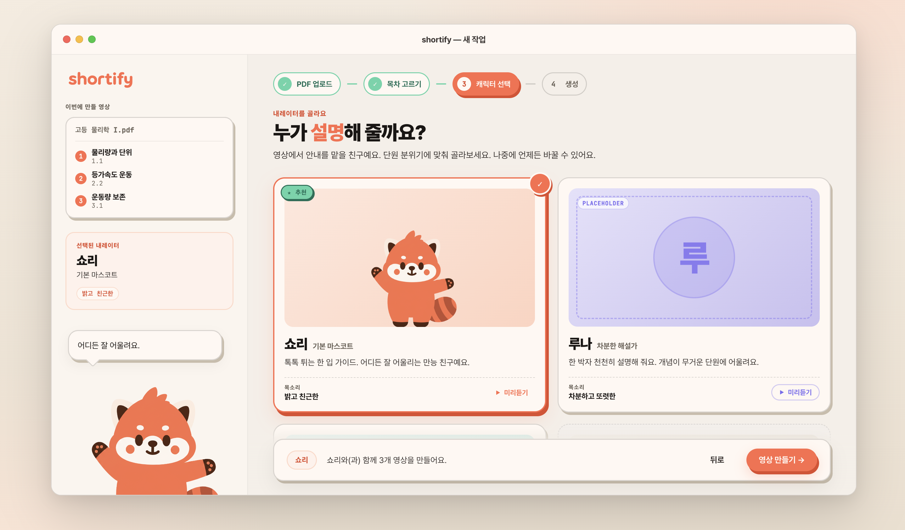

# 04-03. Character Select (캐릭터 선택)

> **Owner**: 김성곤 · **Status**: Approved · **Last Updated**: 2026-04-26 · **Step**: 3 / 4

영상의 진행자 캐릭터를 고른다. 기본은 `쇼리(Shori)` ([character/01-bible](../../character/01-bible.md)).

- **정본 HTML**: [`/design/ui/shortify-html-design/Shortify Character Select.html`](../../../../design/ui/shortify-html-design/Shortify%20Character%20Select.html)
- **정본 JSX**: [`/design/ui/shortify-html-design/shortify-character-select.jsx`](../../../../design/ui/shortify-html-design/shortify-character-select.jsx)
- **스크린샷**: [`/design/ui/screens/step3-ui.png`](../../../../design/ui/screens/step3-ui.png)



---

## 1. 레이아웃

```
┌─ MacWindow ─────────────────────────────────────────────────┐
│ ┌─ Sidebar ─┐ ┌─ TitleBar ──────────────────────────────┐  │
│ │           │ ├─────────────────────────────────────────┤  │
│ │           │ │ StepIndicator [● ● ● ○]   active=3      │  │
│ │           │ ├─────────────────────────────────────────┤  │
│ │           │ │ ┌─ SideRail ─┐  ┌─ CharacterPortrait ─┐ ┌─ ShoriPanel ─┐│
│ │           │ │ │ PDF 메타    │  │  대형 일러스트       │ │ 카피 + 메타  ││
│ │           │ │ │ Picked 5    │  │  (선택된 캐릭터)     │ │              ││
│ │           │ │ │ Recap        │  │                     │ │              ││
│ │           │ │ │              │  │ ┌─ CharacterCard ─┐│ │              ││
│ │           │ │ │              │  │ │  × N (가로 스크롤)│ │              ││
│ │           │ │ └─────────────┘  │ └────────────────┘│ └──────────────┘│
│ │           │ │ [뒤로]                       [영상 만들기]              │
│ │           │ └─────────────────────────────────────────┘             │
└──────────────────────────────────────────────────────────────────────┘
```

## 2. 비즈니스 룰

- 캐릭터 1명 단일 선택. 디폴트 `shori`.
- TOC에서 고른 5개 섹션은 좌측 `SideRail`에 recap (`PICKED_RECAP`, `shortify-character-select.jsx:16`).

## 3. 데이터

`CHARACTERS` 배열 (`shortify-character-select.jsx:26~`). 현재 정의:

| id | name | tagline | 비고 |
|----|------|---------|------|
| `shori` | 쇼리 | 기본 마스코트 — 친근하고 다정한 톤 | 기본값, 항상 활성 |
| (추가 후보) | … | … | TODO — 캐릭터 로스터 확장 시 본 표 갱신 |

## 4. 컴포넌트

| 영역 | 컴포넌트 | 정본 라인 |
|------|----------|-----------|
| 좌측 패널 | `SideRail` (PDF 메타 + Picked Recap) | `shortify-character-select.jsx:420` |
| 메인 | `CharacterPortrait` | `:650` |
| 메인 | `CharacterCard` (다중) | `:759` |
| 우측 패널 | `ShoriPanel` | `:595` |
| 마스코트 | `Shori` (size 140) | `:85` |
| 보조 | `SpeechBubble`, `Btn`, `Chip`, `Meta`, `StepIndicator` | `:136, :212, :575, :996, :347` |
| 전체 | `CharacterSelectView` | `:1029` |

## 5. CharacterCard — 상태

| 상태 | 시각 |
|------|------|
| `idle` | Cream 배경, `--hairline-strong` 보더, `shadow-stamp-md` |
| `hover` | lift (`shadow-md`), 보더 `--ink-faint` |
| `picked` | `--coral-500` 보더 2px + `--shadow-coral` glow + Cream 배경 유지 |

`picked` 카드는 `CharacterPortrait`에 동기화됨.

## 6. 마스코트 / 카피

`ShoriPanel` 우측. 선택된 캐릭터에 따라 카피 분기:

- `shori` 선택: "내가 같이 갈게! 잘 부탁해" (talking=true)
- 다른 캐릭터: 해당 캐릭터의 인사 카피 (TODO — 캐릭터별 정의 필요)

## 7. 인터랙션

| 트리거 | 결과 |
|--------|------|
| CharacterCard 클릭 | `picked` 갱신 → Portrait/ShoriPanel 동시 업데이트 (200ms) |
| `영상 만들기` 버튼 | Generating으로 전환 (Step 3 → 4), 백엔드 잡 enqueue |
| `뒤로` 버튼 | TOC Select로 회귀 (선택 보존) |

## 8. Tweaks 디폴트 (`Shortify Character Select.html:136-140`)

```json
{ "windowMode": "framed", "showSidebar": true, "selectedCharacter": "shori" }
```

## 9. 인계 체크리스트

- [ ] 캐릭터 카드 가로 스크롤 vs 그리드 결정 (현재 가로 스크롤)
- [ ] `picked` 시 coral glow 강도 검토 (다른 화면 coral CTA와 충돌 회피)
- [ ] 캐릭터 로스터 확장 정책 ([character/01-bible](../../character/01-bible.md))
- [ ] `shori` 외 캐릭터의 마스코트 모션·카피 정의
- [ ] 다크모드

---

## 변경 이력

| 날짜 | 작성자 | 변경 |
|------|--------|------|
| 2026-04-26 | 김성곤 | HTML 정본 + 스크린샷 기반 화면 명세 작성 |
