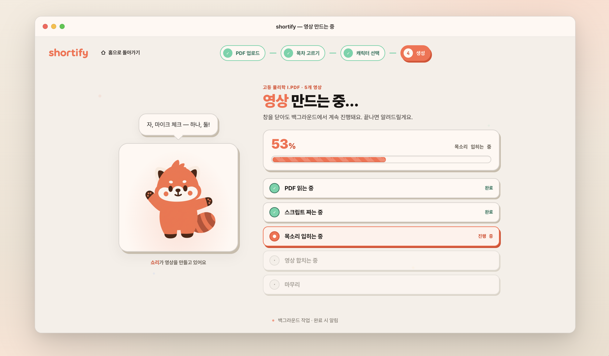

# 04-04. Generating (영상 생성 중)

> **Owner**: 김성곤 · **Status**: Approved · **Last Updated**: 2026-04-26 · **Step**: 4 / 4

영상 생성 진행 화면. 백엔드 파이프라인 ([`prd/architecture/06-pipeline`](../../../prd/architecture/06-pipeline.md)) 의 stage 진행을 5개 페이즈로 압축해 시각화한다.

- **정본 HTML**: [`/design/ui/shortify-html-design/Shortify Generating.html`](../../../../design/ui/shortify-html-design/Shortify%20Generating.html)
- **정본 JSX**: [`/design/ui/shortify-html-design/shortify-generating.jsx`](../../../../design/ui/shortify-html-design/shortify-generating.jsx)
- **스크린샷**: [`/design/ui/screens/step4-ui.png`](../../../../design/ui/screens/step4-ui.png)



---

## 1. 레이아웃

```
┌─ MacWindow ─────────────────────────────────────────────────┐
│ ┌─ Sidebar ─┐ ┌─ TitleBar ──────────────────────────────┐  │
│ │           │ ├─────────────────────────────────────────┤  │
│ │           │ │ StepIndicator [● ● ● ●]   active=4      │  │
│ │           │ ├─────────────────────────────────────────┤  │
│ │           │ │ ┌─ Big Shori (size=240, talking) ─────┐  │  │
│ │           │ │ │  + SpeechBubble (페이즈별 카피)     │  │  │
│ │           │ │ └────────────────────────────────────┘  │  │
│ │           │ │                                          │  │
│ │           │ │ ┌─ ProgressBar (8px, coral) ─ 42% ────┐ │  │
│ │           │ │ │  ▓▓▓▓▓░░░░░░░░░░ 줄무늬 애니        │ │  │
│ │           │ │ └────────────────────────────────────┘ │  │
│ │           │ │                                          │  │
│ │           │ │ ┌─ PhaseList ────────────────────────┐  │  │
│ │           │ │ │ ✓ PDF 읽는 중                       │  │  │
│ │           │ │ │ ⏳ 스크립트 짜는 중 (active)         │  │  │
│ │           │ │ │ ○ 목소리 입히는 중                  │  │  │
│ │           │ │ │ ○ 영상 합치는 중                    │  │  │
│ │           │ │ │ ○ 마무리                            │  │  │
│ │           │ │ └────────────────────────────────────┘ │  │
│ │           │ └─────────────────────────────────────────┘ │
└──────────────────────────────────────────────────────────────┘
```

## 2. PHASES (정본)

`shortify-generating.jsx:27-33` — 5단계, 각 페이즈는 progress range 보유:

| ID | 라벨 | range | 마스코트 카피 (`bubble`, `:436~`) |
|----|------|-------|-----------------------------------|
| `read` | PDF 읽는 중 | 0–18 | "내용을 차근차근 읽고 있어…" |
| `outline` | 스크립트 짜는 중 | 18–42 | "이야기 흐름을 잡는 중!" |
| `voice` | 목소리 입히는 중 | 42–68 | "목소리 녹음 중이야…" |
| `render` | 영상 합치는 중 | 68–94 | "이제 영상으로 합치는 중!" |
| `finish` | 마무리 | 94–100 | "거의 다 됐어, 잠시만…" |

> **백엔드 매핑**: 파이프라인의 9-stage 모델 → 5-phase UI. 매핑 규칙은 [`prd/architecture/06-pipeline`](../../../prd/architecture/06-pipeline.md)에 정의 (TODO).

## 3. 컴포넌트

| 영역 | 컴포넌트 | 정본 라인 |
|------|----------|-----------|
| 마스코트 | `Shori` (size 240, talking=true, withShadow) | `shortify-generating.jsx:39` |
| 말풍선 | `SpeechBubble` (페이즈 변경 시 `bubble-text` 페이드) | `:80` |
| 진행도 | `ProgressBar` (8px, coral, `progress-stripes`) | `:308` |
| 페이즈 | `PhaseList` | `:346` |
| 보조 | `Btn`, `StepIndicator` | `:146, :254` |
| 전체 | `GeneratingView` | `:418` |

## 4. PhaseList — 행 상태 3종

| 상태 | 조건 | 좌측 아이콘 | 텍스트 컬러 |
|------|------|--------------|-------------|
| `done` | `progress >= range[1]` | ✓ (mint-500 원) | `--ink-mute` |
| `active` | `range[0] <= progress < range[1]` | spinner / pulse-dot (coral) | `--ink` 굵게 |
| `pending` | `progress < range[0]` | 빈 원 (`--ink-faint`) | `--ink-faint` |

전이: 페이즈 변경 시 done 체크가 200ms `easing-emphasis`로 그려짐.

## 5. ProgressBar 명세

- 높이 8px, radius `radius-sm`(6) 또는 `--radius-full`
- 채움: `--coral-500`, 배경: `--warm-100`
- 줄무늬 애니: `progress-stripes` (1.2s linear infinite)
- 0~99 캡 (`progress = Math.min(99, Math.max(0, auto))`, `:430`) — 100% 도달 시 완료 화면으로 자동 전환

## 6. 마스코트 모션

- `talking=true` → `shori-talk` 키프레임 활성
- `withShadow=true` → 아래 그림자가 `shori-shadow` 키프레임 (스케일 / 투명도 호흡)
- 페이즈 변경 시 SpeechBubble 텍스트만 교체 (`bubble-text` 페이드), 마스코트는 끊김 없음

## 7. 인터랙션

| 트리거 | 결과 |
|--------|------|
| 100% 도달 | 완료 화면(라이브러리 행)으로 전환, 토스트 (TODO) |
| 백엔드 실패 이벤트 | 실패 화면 — 페이즈 행에 X + 재시도 버튼 (TODO) |
| `취소` 버튼 (선택적) | 확인 모달 → 잡 취소 → Main 회귀 (TODO) |
| 윈도우 최소화 / 백그라운드 | macOS Dock 알림 + Notification (`assets/sound/notification`) (TODO) |

## 8. Tweaks 디폴트 (`Shortify Generating.html:144-148`)

```json
{ "windowMode": "framed", "progress": 42, "phase": "render" }
```

> `progress` 슬라이더 + `phase` 토글로 마스코트 카피·PhaseList 상태를 미리 본다.

## 9. 인계 체크리스트

- [ ] 9-stage → 5-phase 매핑 표 (백엔드 파이프라인 동기화)
- [ ] 실패 상태 시안
- [ ] 완료 전환 애니메이션 (스크롤 / 페이드 / 라이브러리 카드 lift-in)
- [ ] 백그라운드 진행 시 알림 사운드 ([character/02-usage §5](../../character/02-usage.md#5-사운드-예정))
- [ ] 마스코트 카피의 한국어 톤 검수 ([brand/01-identity §4](../../brand/01-identity.md))
- [ ] 다크모드

---

## 변경 이력

| 날짜 | 작성자 | 변경 |
|------|--------|------|
| 2026-04-26 | 김성곤 | HTML 정본 + 스크린샷 기반 화면 명세 작성 |
